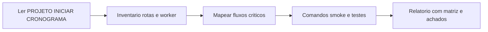

# Quality Assurance — Recovery Engine Brasil

Skill para **análise sistemática de qualidade de software** neste monorepo: entender o produto, mapear superfícies, validar fluxos críticos, cruzar com documentos oficiais e produzir relatório acionável. Complementa a skill de **red team** (segurança); não a substitui.

## 1. Relação com a skill de segurança

| Use esta skill (QA) | Use `security-red-team-recovery-engine` |
|----------------------|----------------------------------------|
| Comportamento esperado vs real, regressão funcional | Modelagem de ameaças, OWASP, testes offensive autorizados |
| Fluxo lógico webhook → fila → worker → ação | Bypass de auth, IDOR como vetor de ataque, HMAC/webhook abuse |
| Estados de UI (loading/erro/vazio), mensagens ao usuário | Política de CORS, segredos, exposição de tokens |
| Cobertura de testes, smokes, gaps de automação | Pentest prep e checklist de hardening |

## 2. Documentos de verdade (ler no início)

- **`PROJETO.md` (raiz)** — Produto, multi-tenant, idempotência, escalabilidade, regras de negócio e segurança em nível de requisito.
- **`INICIAR.md`** — Setup local, variáveis e checklist operacional.
- **`CRONOGRAMA.md`** — Fases e critérios de “done”; usar para alinhar expectativa do que já deveria existir.
- **`.cursor/rules/projet-context.mdc`** — Fluxo DB/RLS, Supabase, `tenant_id`, comandos versionados.

Stack: front em **`apps/web`** (Vite + React); API em **`apps/api`** (Fastify); processamento assíncrono em **`apps/worker`**.

## 3. Mapa do monorepo (superfícies para QA)

| Área | Caminho | Foco de qualidade |
|------|---------|-------------------|
| API HTTP | `apps/api` | Contratos REST, validação, códigos HTTP, erros tratáveis, rate limit vs uso legítimo |
| Worker | `apps/worker` | Consumo de fila, idempotência de efeitos, retries, ordem quando relevante |
| Front | `apps/web` | Fluxos principais, estados assíncronos, feedback de erro, navegação |
| Dados | `packages/db`, `packages/db/sql`, scripts RLS | `tenant_id`, migrações, consistência com `npm run check:db` |
| Integrações | `packages/integrations` | Normalização e contratos por plataforma (comportamento documentado) |
| Core | `packages/core` | Regras puras, tipos canônicos de evento |
| Fila | `packages/queue` | Enfileiramento e saúde da fila |

**Fluxo lógico do produto:** Webhook → validação → persistência mínima / enfileiramento → worker → decisão → ação (ex.: canal de mensagem) → tracking.

## 4. Arquivos âncora (inventário antes de testar manualmente)

| Finalidade | Arquivo / pasta |
|------------|-------------------|
| Plugins globais (CORS, rate limit, body limit, logger) | `apps/api/src/app.ts` |
| Rotas HTTP de domínio | `apps/api/src/routes/*.ts` |
| Entrada de webhooks | `apps/api/src/routes/webhooks-ingress.ts` (ou equivalente no repo) |
| Auth dashboard | `apps/api/src/auth/dashboard-auth.ts` |
| Ponto de entrada do worker | `apps/worker/src/main.ts` |
| Processamento de evento | `apps/worker/src/process-event.ts` |

Ajustar caminhos se o repositório renomear ficheiros; a skill prioriza **descoberta** sobre suposições rígidas.

## 5. Metodologia “do zero”

1. **Contexto** — Resumir em 5–10 linhas o produto e o fluxo canônico a partir de `PROJETO.md`.
2. **Inventário** — Listar apps, rotas registradas em `app.ts`, jobs/handlers no worker e integrações outbound.
3. **Fluxos críticos** — Para cada fluxo principal (ex.: ingestão de webhook, CRUD no dashboard, job assíncrono), documentar **pré-condições**, **caminho feliz** e **falhas esperadas** (4xx/5xx, retry, fila morta/DLQ se existir).
4. **Evidências** — Executar ou referenciar comandos na raiz do monorepo quando o ambiente estiver disponível:

| Comando | Uso típico |
|---------|------------|
| `npm run smoke` | Smoke de adaptadores + API dashboard |
| `npm run smoke:pipeline` | Pipeline ponta a ponta |
| `npm run test:api` | Vitest em `@re/api` |
| `npm run check:db` | Schema/DB alinhado ao esperado |
| `npm run check:queue` | Saúde da fila |
| `npm run audit:env` | Variáveis de ambiente necessárias |
| `npm run audit:memberships` | Consistência memberships / tenants |
| `npm run lint` | Qualidade estática em workspaces |

Se um comando falhar por ambiente (sem DB, sem rede), registrar como **limitação do teste**, não como bug sem evidência.

5. **Multi-tenant (QA funcional)** — Cenários onde usuário/tenant A não visualiza nem altera dados de B; se não houver teste automatizado cross-tenant (`PROJETO.md` §5.2), registrar **gap** com prioridade sugerida.
6. **Síntese** — Relatório com severidade orientada a negócio e usuário (Bloqueador / Alto / Médio / Baixo / Melhoria).

## 6. Checklists por camada

### 6.1 API

- Entradas mutáveis com schema explícito (ex.: Zod); rejeição clara de payload inválido.
- Códigos HTTP e corpos de erro **consistentes** e acionáveis pelo cliente (dashboard/scripts).
- Rate limiting: fluxos legítimos (ex.: burst após login) não quebram sem alternativa documentada.
- Webhooks: idempotência e duplicatas tratadas conforme documentação do projeto.

### 6.2 Worker e filas

- Mesmo evento enfileirado duas vezes não deve corromper estado de negócio (efeito idempotente ou deduplicação).
- Retries: backoff e limite; falhas finais observáveis (log/métrica) sem sumir silenciosamente.
- Ordem: quando o produto exige ordenação, validar se o código a respeita.

### 6.3 Web (Vite/React)

- Estados: carregando, vazio, erro, sucesso em telas críticas.
- Chamadas à API: tratamento de erro de rede e 4xx/5xx; evitar telas “travadas” sem feedback.
- **Acessibilidade (smoke):** foco, labels em formulários importantes, contraste razoável — sem substituir auditoria a11y formal.

### 6.4 Dados e migrações

- Entidades de negócio com `tenant_id` onde `PROJETO.md` exige.
- Migrações e RLS versionados; após mudanças, fluxo do projeto: `npm run db:rls`, `npm run check:db` quando aplicável.

### 6.5 Observabilidade (qualidade operacional)

- Logs úteis para diagnosticar falhas de integração sem registrar payload completo de webhook em produção quando a política do projeto proíbe.
- Mensagens de erro ao operador humano claras o suficiente para suporte de primeiro nível.

## 7. Template de saída (relatório)

**Resumo executivo** — Parágrafo único: escopo da análise, maior risco ou gap para o usuário final, próximo passo recomendado.

**Escopo e ambiente** — Branch/commit ou data; local ou staging; comandos executados e resultado (passou / falhou / não executado).

**Matriz fluxo × status** — Tabela: fluxo | status (OK / falha / não testado) | nota breve.

**Achados** — Ordenar por severidade: Bloqueador, Alto, Médio, Baixo, Melhoria.

Para **cada** achado:

- **ID** (ex.: QA-2026-001)
- **Camada** (API, worker, web, dados, processo)
- **Pré-condições** (tenant, papel, dados de teste)
- **Passos de reprodução**
- **Comportamento esperado vs observado**
- **Impacto** ao usuário ou ao negócio
- **Sugestão** (código, teste, doc, config)
- **Referência no repo** — arquivo e, se possível, função ou trecho

**Gaps de automação** — O que só foi validável manualmente; sugestão de teste automatizado (Vitest, smoke script).

**Próximos passos** — Lista curta e priorizada.

## 8. Fluxo visual

## 9. Notas finais

- Esta skill **não** dispensa testes exploratórios humanos nem critérios de aceite de produto acordados com stakeholders.
- Para qualquer teste contra ambiente que não seja claramente de desenvolvimento do usuário, **confirmar autorização** antes de instruir passos destrutivos ou com alto volume.
