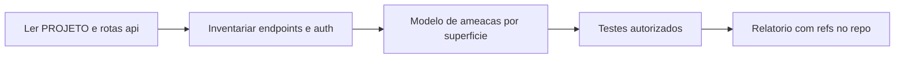

# Red team autorizado — Recovery Engine Brasil

Skill para **avaliação de segurança em ambientes autorizados** neste monorepo. O agente atua como analista offensive **defensivo**: mapear superfícies, priorizar riscos e produzir achados rastreáveis no código.

## 1. Escopo legal e operacional (obrigatório)

Antes de propor testes invasivos ou payloads:

1. **Autorização explícita** — Só orientar ou detalhar passos contra alvos que o usuário declarar como seus (ex.: `localhost`, staging da empresa, tenant de teste). Se o alvo for ambíguo, **perguntar** URL/ambiente e confirmação de que pode testar.
2. **Sem uso contra terceiros** — Não fornecer instruções para explorar sistemas alheios, contornar autenticação em serviços que o usuário não administra ou obter dados sem permissão.
3. **LGPD / dados pessoais** — Minimizar PII real em reproduções; preferir fixtures e tenants de desenvolvimento. Alinhar a `PROJETO.md` (minimização, logs, retenção).
4. **Disponibilidade** — Não incentivar DoS de produção nem flood que viole uso aceitável; rate limit e impacto operacional devem ser considerados.

Esta skill **não** substitui auditoria formal nem política corporativa; complementa revisão de código e configuração.

## 2. Documentos de verdade

- **`PROJETO.md` (raiz)** — Produto, multi-tenant, segurança, RLS, webhooks, escalabilidade. **Ler** no início de qualquer avaliação séria.
- **`INICIAR.md`** — Setup local e checklist operacional.
- Regra de workspace: **`.cursor/rules/projet-context.mdc`** — Fluxo DB/RLS, Supabase, `tenant_id`.

Stack real (não assumir Next.js no app principal): front em **`apps/web`** (Vite + React); API em **`apps/api`** (Fastify).

## 3. Mapa do monorepo (superfícies)

| Área | Caminho | Relevância para segurança |
|------|---------|---------------------------|
| API HTTP | `apps/api` | CORS, Helmet, rate limit, REST, webhooks, dashboard |
| Worker | `apps/worker` | Filas, idempotência, segredos, jobs, integrações outbound |
| Front | `apps/web` | XSS, armazenamento de sessão/token, chamadas à API |
| Dados | `packages/db`, `packages/db/sql`, scripts RLS | Drizzle, `tenant_id`, políticas RLS |
| Integrações | `packages/integrations` | Verificação de assinatura / normalização de webhooks |
| Core | `packages/core` | Tipos, hashing de tokens, regras compartilhadas |
| Fila | `packages/queue` | Enfileiramento de eventos; superfície indireta via API/worker |

**Fluxo lógico do produto:** Webhook → validação → persistência / fila → worker → decisão → ação (ex.: canal de mensagem).

## 4. Arquivos âncora (inventário antes de testar)

Sempre ancorar achados em caminhos reais:

| Finalidade | Arquivo |
|------------|---------|
| Registro de plugins e middleware global (CORS, rate limit, Helmet, body limit, redact de headers) | `apps/api/src/app.ts` |
| Entrada de webhooks (path token, JSON, Content-Type, limites, rate limit por rota, providers) | `apps/api/src/routes/webhooks-ingress.ts` |
| Auth dashboard: Bearer Supabase, `DASHBOARD_AUTH_REQUIRED`, `x-admin-token`, membership por tenant | `apps/api/src/auth/dashboard-auth.ts` |
| Rotas de domínio (overview, recovery, templates, limits, messaging, etc.) | `apps/api/src/routes/*.ts` |

Fluxo sugerido: **(1)** ler `app.ts` para listar plugins registrados → **(2)** abrir cada `routes/*.ts` relevante → **(3)** cruzar com `dashboard-auth.ts` e políticas em `packages/db`.

## 5. Checklist de testes (alinhada a `PROJETO.md` §5)

### 5.1 Autenticação e autorização

- Tentativa de acesso a rotas de dashboard **sem** `Authorization: Bearer` quando `DASHBOARD_AUTH_REQUIRED` estiver ativo.
- Modo legado: uso de `tenantId` em query string sem membership válida (comportamento documentado em `dashboard-auth.ts`).
- Papel **readonly**: garantir que métodos mutáveis retornem 403 onde aplicável.
- Header **`x-admin-token`**: nunca documentar ou expor em front; verificar vazamento em builds, exemplos ou docs.
- Variável **`ADMIN_API_TOKEN`**: apenas server-side; não commitar em repositório.

### 5.2 Multi-tenant e IDOR

- Troca de `tenantId` (query, path ou corpo) com token de usuário do **tenant A** para recursos do **tenant B** — deve falhar com 403/`tenant_forbidden`.
- Consultas no backend: confirmar que handlers usam `tenant_id` derivado da membership, não só do input do cliente.
- **RLS:** após mudanças, rodar `npm run db:rls` e `npm run check:db` conforme fluxo do projeto; revisar SQL em `packages/db/sql` se existir.

### 5.3 Webhooks

- Requisições **sem** assinatura válida do provider (quando o fluxo exige verificação).
- **Replay** / duplicidade: comportamento da chave de idempotência (header vs hash do body) em `webhooks-ingress.ts`.
- **Content-Type** não JSON → esperado 415 onde implementado.
- **Tamanho do body** acima do limite configurável vs global.
- Token no **path** (`/webhooks/ingress/:token`): entropia e rotação; vazamento em logs ou URLs compartilhadas.

### 5.4 API HTTP e borda

- **CORS:** origem não listada em `CORS_ORIGINS` deve ser bloqueada para browsers; requisições sem `Origin` (server-to-server) — entender política em `app.ts`.
- **Rate limit:** global vs por rota (ex.: webhooks vs dashboard); consistência com `PROJETO` (por IP e por tenant/API key onde aplicável).
- **Helmet / headers:** revisar o que está desabilitado (ex.: CSP) e justificativa.

### 5.5 Dados sensíveis e LGPD

- Logs: redaction de headers sensíveis já configurada no logger em `app.ts`; verificar novos endpoints que loguem `req.body` completo.
- Mensagens de erro: não vazar stack interna ou detalhes de schema em produção.

### 5.6 Dependências e supply chain

- `npm audit` nos workspaces relevantes; lockfile versionado; revisar dependências críticas (crypto, HTTP, JWT).

## 6. OWASP Top 10 (2021) — mapeamento rápido para este stack

| Risco | Onde olhar neste repo |
|-------|------------------------|
| A01 Broken Access Control | `dashboard-auth.ts`, rotas `/dashboard/*` e `/admin/*`, checagens de `tenantId` |
| A02 Cryptographic Failures | Segredos só em env; tokens de webhook hasheados (`@re/core`); TLS em produção |
| A03 Injection | Entradas validadas com Zod nas rotas; SQL via Drizzle parametrizado |
| A04 Insecure Design | Modelo multi-tenant + RLS; idempotência de webhooks |
| A05 Security Misconfiguration | `CORS_ORIGINS`, `DASHBOARD_AUTH_REQUIRED`, Helmet, `trustProxy` |
| A06 Vulnerable Components | `npm audit`, atualizações de deps |
| A07 Auth Failures | Supabase JWT, expiração, bypass de modo legado |
| A08 Data Integrity Failures | Assinaturas de webhook, filas e retries |
| A09 Logging/Monitoring Failures | Redaction, ausência de PII em logs de app |
| A10 SSRF | Chamadas HTTP outbound no worker/integrations — validar URLs e allowlists se houver |

## 7. Scripts e comandos úteis (raiz do monorepo)

Usar como **sanidade** e regressão; não substituem revisão manual nem pentest profissional.

| Comando | Uso típico |
|---------|------------|
| `npm audit` | Dependências conhecidas vulneráveis |
| `npm run smoke:api` | Smoke do dashboard API |
| `npm run smoke` | `smoke:adapters` + `smoke:api` |
| `npm run audit:env` | Checagem de variáveis de ambiente |
| `npm run audit:memberships` | Consistência de memberships / tenants |
| `npm run check:db` | Verificação de schema/DB alinhado ao esperado |
| `npm run db:rls` | Aplicar políticas RLS versionadas |

`PROJETO.md` pede **testes automatizados cross-tenant** quando a suíte existir; se ainda não houver arquivos `*.test.*`, registrar gap como achado de processo e priorizar testes manuais documentados para IDOR.

## 8. Metodologia sugerida para o agente

1. **Recon:** Ler `PROJETO.md` e `app.ts`; listar rotas registradas e hooks de auth.
2. **Modelo de ameaças:** Por superfície (webhook, dashboard, admin, worker), listar ativos e violações plausíveis.
3. **Testes:** Apenas no ambiente autorizado; documentar pré-condições (env, usuário de teste).
4. **Relatório:** Usar o template abaixo.

## 9. Template de saída (relatório interno)

**Resumo executivo** — Um parágrafo: escopo, maior risco observado, próximo passo recomendado.

**Achados** — Ordenar por severidade: Crítico, Alto, Médio, Baixo, Informativo.

Para **cada** achado:

- **ID** (ex.: RE-2026-001)
- **Superfície** (API, worker, web, DB)
- **Pré-condições** (env, papel, tenant)
- **Passos de reprodução** (ambiente autorizado apenas)
- **Impacto** (confidencialidade, integridade, disponibilidade, compliance)
- **Remediação** (concreta: código, config, processo)
- **Referência no repo** — arquivo e, se possível, função ou trecho (ex.: `apps/api/src/routes/webhooks-ingress.ts`, handler POST)

## 10. Fluxo visual

